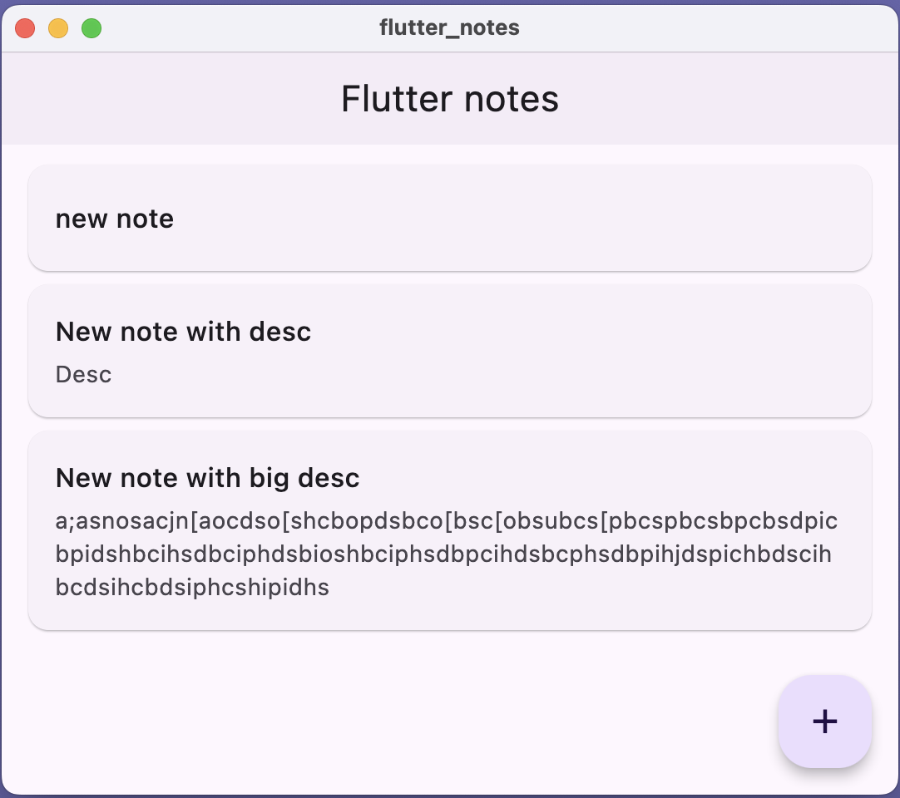
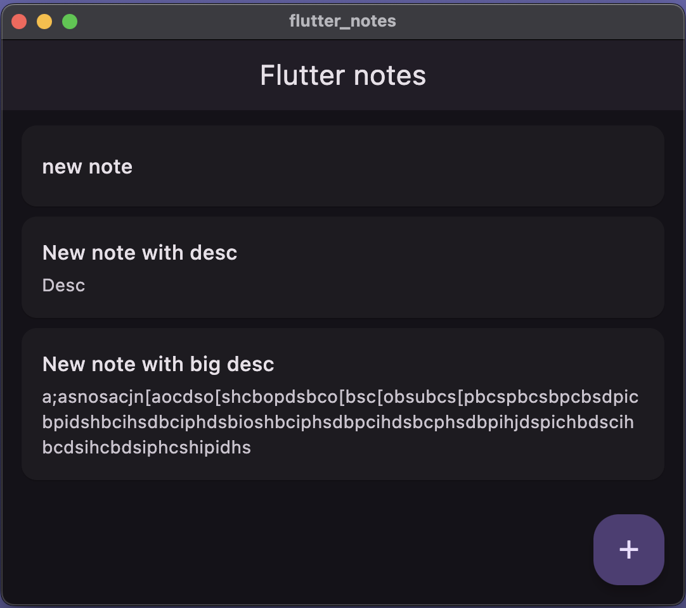
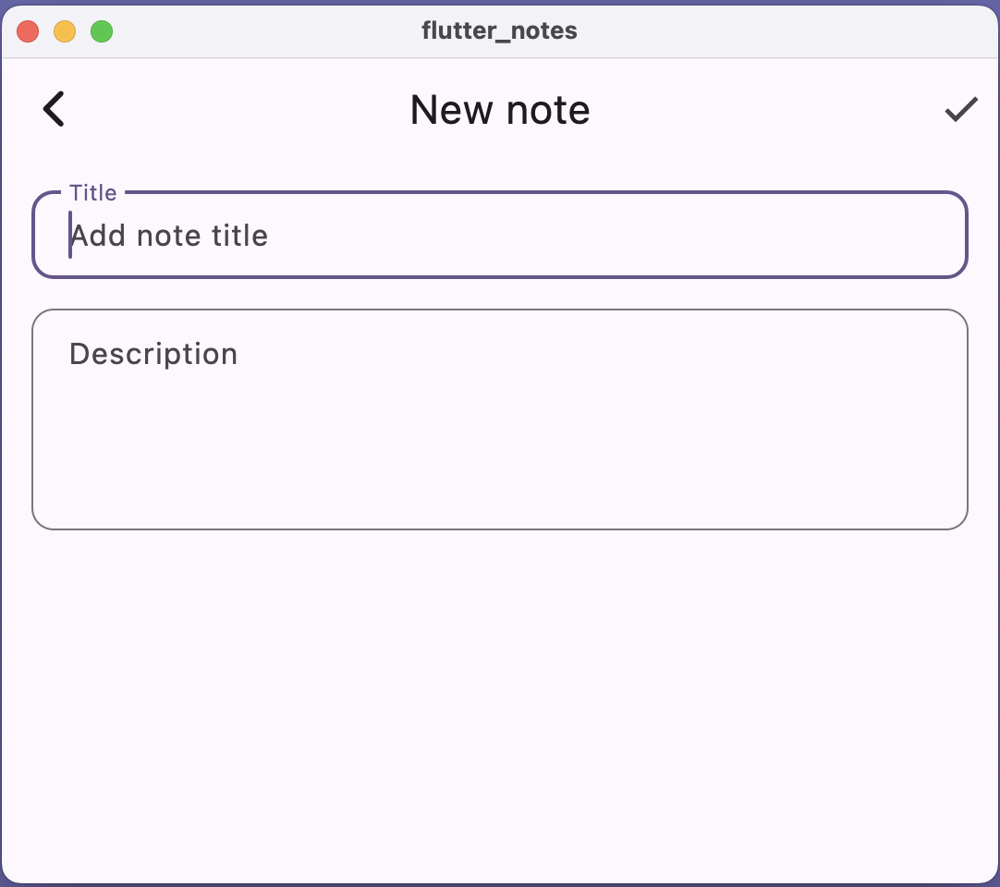
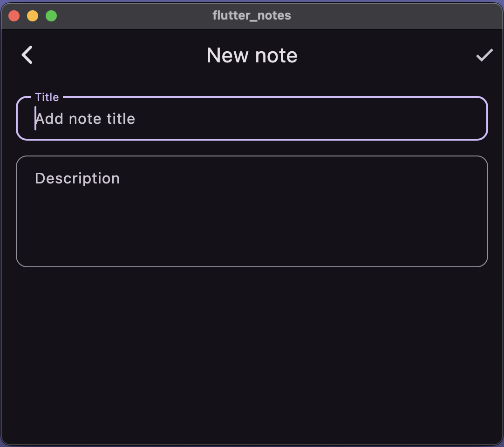
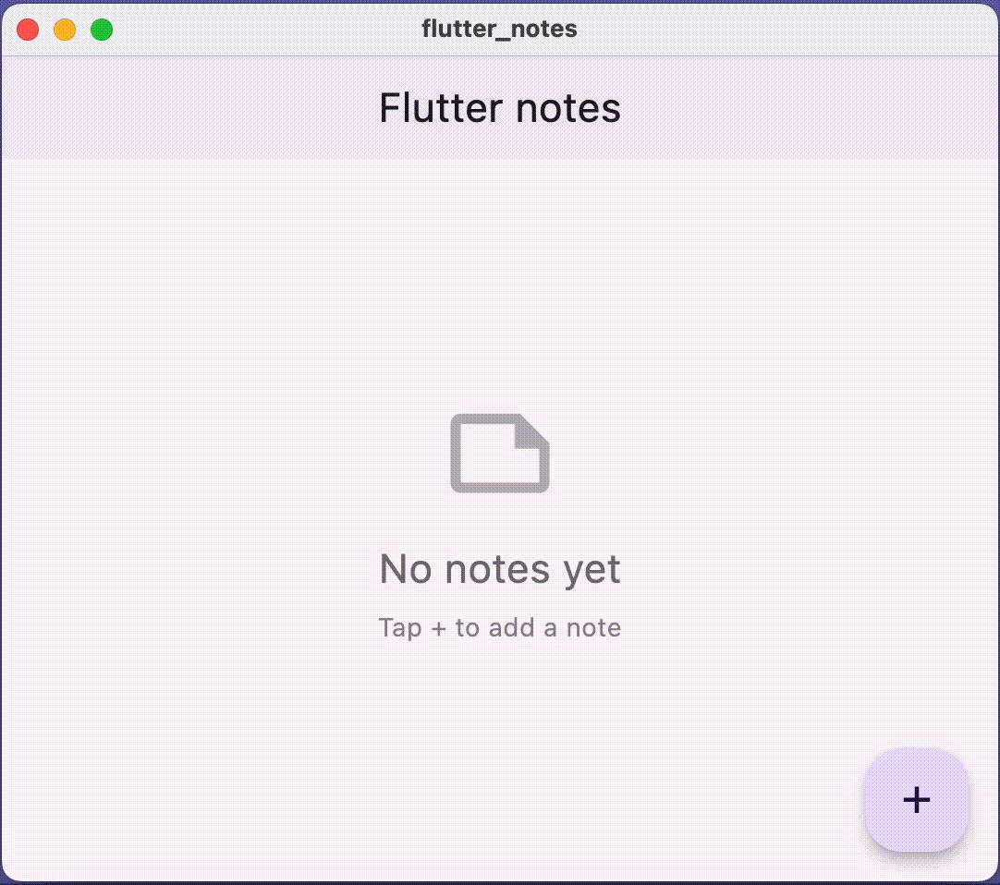

# Flutter Notes

A simple one-page Flutter application for adding and displaying a list of notes.

## Description

The application allows users to create notes with a title and description. All data is stored in memory. The note title is a required field.

## Screenshots

### Main Screen
<div align="center">
  
  
</div>

### Add Note Screen
<div align="center">
  
  
</div>

### Demo
<div align="center">
  
</div>

## Installation & Running

### Requirements
- Dart SDK >=3.5.0 <4.0.0
- Flutter (any version with Dart SDK >=3.5.0)
- FVM recommended for version management

### Quick Start

```bash
# Install Flutter via FVM
fvm install 3.38.9
fvm use 3.38.9 --save

# Install dependencies
fvm flutter pub get

# Run the application
fvm flutter run

# Run tests
fvm flutter test
```

## Architecture

### Project Structure

```
lib/
├── models/          # Data models (Note entity)
├── state/           # State management (NotesViewModel)
├── ui/
│   ├── pages/       # Screens (MainPage, NotePage)
│   └── widgets/     # Reusable widgets (NoteCard, EmptyState, AppTextField)
└── core/            # Shared (theme, constants)
```

### Architectural Approach: MVVM

**Why MVVM?**
- **Separation of concerns**: Business logic (`ViewModel`) separated from UI (`View`)
- **Testability**: ViewModel can be tested independently
- **Maintainability**: Changes in UI don't affect business logic and vice versa
- **Scalability**: Easy to add features without breaking existing code

**Implementation:**
- **Model**: `Note` entity (data structure)
- **View**: UI pages and widgets (`MainPage`, `NotePage`, etc.)
- **ViewModel**: `NotesViewModel` (manages state, business logic)

### Key Decisions

**1. Provider for State Management**
- Chosen over `setState` to separate business logic from UI
- `NotesViewModel` manages notes list and notifies UI via `notifyListeners()`
- Simple and sufficient for this project size

**2. StatefulWidget for Form**
- `NotePage` uses `StatefulWidget` to manage form controllers
- Validates title field (required) before saving
- Returns result via `Navigator.pop()` to update parent list

**3. Centralized Theme System**
- `_baseTheme()` method contains shared theme configuration
- `lightTheme` and `darkTheme` reuse base configuration (DRY principle)
- Supports system theme (`ThemeMode.system`) - automatically switches based on device settings
- Single source of truth for styling ensures consistency

**4. Constants for Consistency**
- Spacing, radius, and icon sizes in `values_manager.dart`
- Prevents magic numbers, ensures consistent design
- Easy to maintain and update globally

**5. Reusable Widgets**
- `NoteCard` - extracted to optimize rebuilds (only redraws when specific note changes)
- `EmptyState` - consistent empty state across app
- `AppTextField` - unified text field styling

**6. Smooth Animations**
- Custom slide transition for navigation (slide from right)
- Provides pleasant visual feedback
- Uses `Curves.fastOutSlowIn` for natural feel

**7. Data Storage**
- In-memory storage
- List automatically updates after adding new note via Provider

**8. Performance**
- `const` constructors where possible
- `ListView.builder` for lazy loading
- Widget extraction minimizes unnecessary rebuilds

## Testing

```bash
flutter test                    # Run all tests
flutter test --coverage         # With coverage
```

## CI/CD

Automated workflows using GitHub Actions:

**CI (Continuous Integration)**
- Runs on every push/PR to `main` and `dev` branches
- Only triggers on code changes (ignores documentation updates)
- Verifies code formatting (`dart format`)
- Analyzes code quality (`flutter analyze`)
- Runs test suite (`flutter test`)

**CD (Continuous Deployment)**
- Automatically deploys web version to GitHub Pages on push to `main`
- Can be manually triggered via `workflow_dispatch`
- Only triggers on code changes (ignores documentation updates)

This ensures code quality and prevents broken code from being merged or deployed.

## Technologies

- Flutter + Provider (state management)
- Material Design 3 (theming)
- GitHub Actions (CI/CD)
